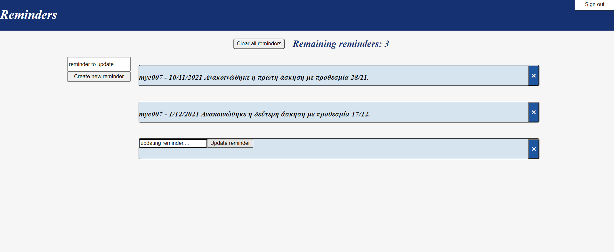

# Description
Really simple and basic reminders/todos full stack web application made with the **MERN** stack.

## Technologies used: 
* **MongoDB**
* **Express.js**
* **React.js**
* **Node.js**

## Authentication
Server side authentication with **Passport.js** and express-session.

## Architecture
The application consists of an express web server (server folder) and a react app (client folder).

* The express web server follows the MVC architecture and exposes a REST api for CRUD operations on reminders/todos.

* The react app/client makes calls to the api and displays the appropriate data.

## Todo
* Do some testing with Jest and Supertest.
* Design the UI a little bit better in terms of css (the functionality is there).

# Running application example
## Installing the app
Install the npm dependencies on both client (client folder) and server (server folder), and:
* Start the server -> **npm start** (inside the server folder).
* Start the react app -> **npm start** (inside the client folder).
* Then you can open your browser at http://localhost:3000 and use the web app (if you start the client with npm start inside the client folder and you wait chrome opens automatically).

## Using the application:
* create a new reminder -> Enter the reminder in the **Enter new reminder...** input and then press the **Create new reminder** button.
* update a reminder -> Click on the reminder text/content then an input (**update reminder...**) and a button (**Update reminder**) will appear. Enter the updated text in the input and submit with the button, so the reminder will update.
* delete a reminder -> Press the **X** button right of the reminder.
* clear/delete all reminders -> **Clear all reminders** button.